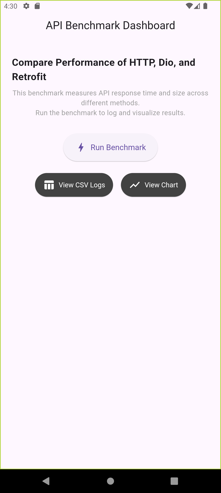
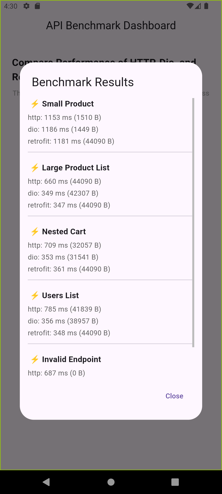
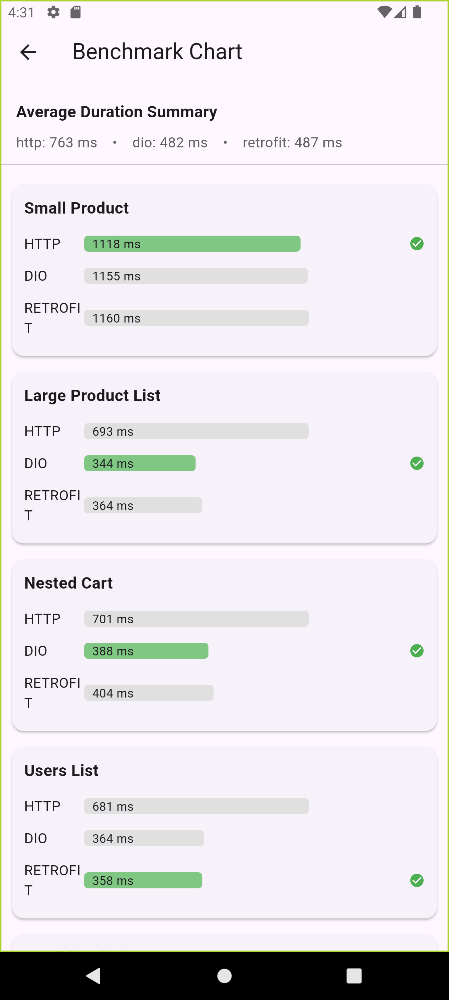
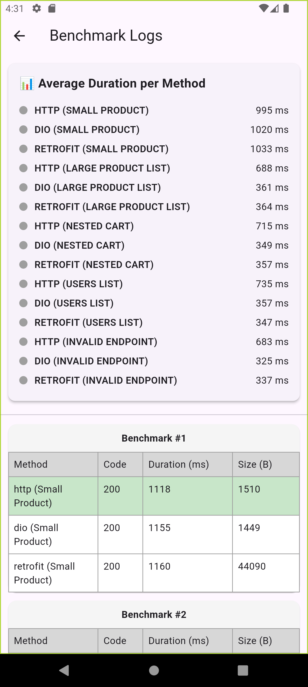

# 📊 API Performance Benchmarking in Flutter

A Flutter-based benchmarking tool that evaluates the performance of popular HTTP clients—**http**, **dio**, and **retrofit**—across multiple API test cases. This tool helps measure and compare **response time**, **payload size**, and **error handling efficiency** under controlled conditions.

&nbsp;&nbsp;&nbsp;
---

## ✨ Features

- 🔁 Benchmarks multiple HTTP clients (http, dio, retrofit)
- 🧪 Custom test cases for different API endpoints (e.g., single product, full list, nested data)
- 📈 Visual comparison using bar charts
- 📋 Organized tabular log of all benchmarks
- 💾 CSV logging for offline analysis
- 🧠 Automatic detection of fastest method per test case
- 💡 Summary card showing average performance by method

---

## 🧪 Benchmark Test Cases

| Test Case             | Endpoint              | Purpose                         |
|----------------------|-----------------------|---------------------------------|
| Small Product         | `/products/1`         | Simple JSON response            |
| Large Product List    | `/products`           | Bulk data handling              |
| Nested Cart           | `/carts`              | Nested objects and arrays       |
| Users List            | `/users`              | Moderate payload                |
| Invalid Endpoint      | `/invalid-endpoint`   | Error and fallback handling     |

---

## 📊 Sample Output

### 🔹 Average Duration Summary (ms)
| Method     | Average Duration |
|------------|------------------|
| HTTP       | 122 ms           |
| Dio        | 117 ms           |
| Retrofit   | 133 ms           |

### 🔸 Grouped Benchmark View

Each benchmark includes:
- Response time
- Status code
- Payload size
- Highlighted fastest method

---

## 🚀 Getting Started

### 1. Clone the Repository
```bash
git clone https://github.com/your-username/flutter-api-benchmark.git
cd flutter-api-benchmark
```
### 2. Install Dependencies
```bash
flutter pub get
```

### 3. Run the App  
```bash
flutter run
```

## 🧠 Research Insight
> This benchmarking tool is part of a research initiative to evaluate Flutter's client-side API handling efficiency. It reveals how each package performs under real-world scenarios, offering useful insights for developers choosing the right HTTP client.

## 🗃️ Tech Stack
- Flutter

* Dio

* Retrofit

* fl_chart (for charting)

+ path_provider & csv for local CSV storage

## 📂 Folder Structure

```bash
lib/
├── models/          # ApiResult model
├── services/        # http/dio/retrofit implementations
├── utils/           # CSV logging & file operations
├── screens/         # UI screens (chart, logs, dashboard)
├── constants.dart   # Endpoint definitions
```

## 📄 License
MIT License. You are free to use, modify, and distribute this project with attribution.

## 🙋‍♂️ Author
**Imran Sifat**
Passionate about Flutter and software performance engineering.

> Feel free to fork this project or reach out if you’re conducting similar research or benchmarking!